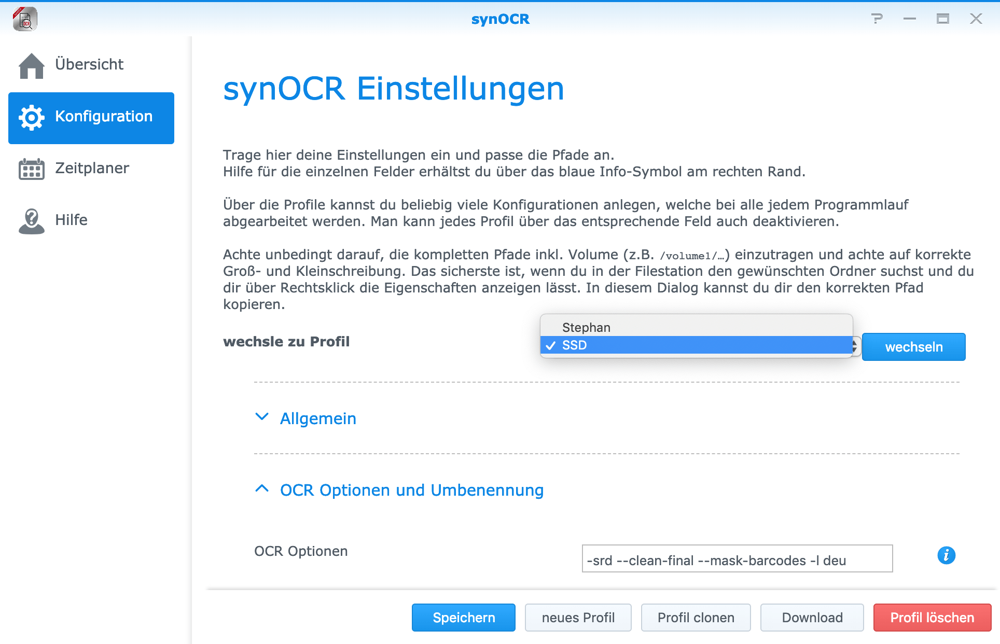
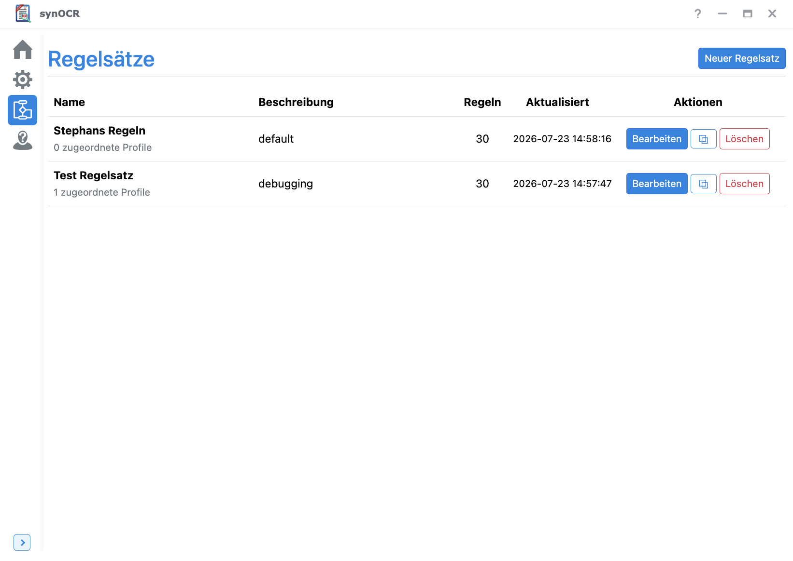
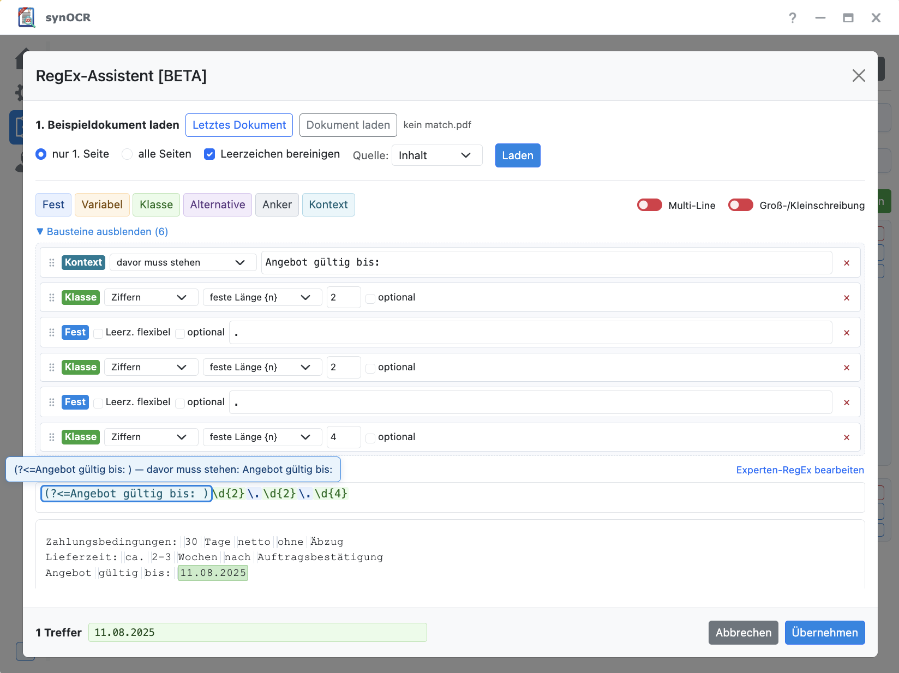

**Translate:**
&nbsp;&nbsp;&nbsp;&nbsp;&nbsp;&nbsp;&nbsp;&nbsp;&nbsp;&nbsp;

---

# synOCR

OCR und Dokumenten-Organisation für deine Synology DiskStation —  
**deine Dateien bleiben Dateien.**

| | |
|---|---|
| **Stabil** | [DSM 7](https://geimist.eu/synOCR/synOCR_DSM7_stable.html) · [DSM 6](https://geimist.eu/synOCR/synOCR_DSM6_stable.html) |
| **Beta** | [DSM 7 Snapshot](https://geimist.eu/synOCR/synOCR_DSM7_snapshot_build.html) |

**Deutsch** · [English](#synocr-english)

---

## Deutsch

synOCR macht gescannte PDFs und Bilder auf dem NAS **durchsuchbar**, benennt sie nach deinem Muster und sortiert sie in Ordner — über eine **DSM-Oberfläche**, ohne dass deine Dokumente in eine proprietäre Datenbank wandern.

Das Konzept ist ein **niedrigschwelliger, GUI-basierter Einstieg**: Profile, Regeln und Abläufe richtest du in der Oberfläche ein. YAML und RegEx bleiben für Fortgeschrittene verfügbar — der Einstieg soll ohne Konfigurationsmarathon funktionieren.

### Was synOCR anders macht

Andere Papierlos-Lösungen speichern Dokumente oft in einer Anwendungsdatenbank. Das hat Stärken (z. B. zentrale Volltextsuche in der App). synOCR geht einen **anderen Weg**:

| | synOCR |
|---|---|
| **Speicherort** | PDFs bleiben in deinen Freigaben und Ordnern |
| **Archiv** | Die Ordnerstruktur *ist* das Archiv |
| **Backup & Portabilität** | normale NAS-Backups, rsync, Snapshots — ohne App-Export |
| **Bedienung** | DSM-Paket mit GUI im Mittelpunkt |

Kein „besser oder schlechter“ — eine **andere Priorität**: Kontrolle und Lesbarkeit im Dateisystem.

### So läuft’s

1. Dokumente in den Eingabeordner legen  
2. synOCR erkennt Text (OCRmyPDF), Datum und Regeln  
3. Dateien werden umbenannt und in Zielordner sortiert  
4. Mehrere Kategorien? **Hardlinks** — ein Inhalt, mehrere Ordner, ohne doppelten Speicher  

### Impressionen

   
  <em>Übersicht / laufende Verarbeitung</em>

   
  <em>Einstellungen</em>

   
  <em>Regeleditor</em>

   
  <em>RegEx-Assistent</em>

### Funktionen im Überblick

- **OCR:** Bilder → PDF; Scans → durchsuchbare PDFs (OCRmyPDF)
- **Umbenennen:** individuelle Namensmuster; Datumssuche inkl. internationaler Formate und ausgeschriebener Monate (OCR-Sprache hilft bei Mehrdeutigkeiten)
- **Bildaufbereitung:** optionale Kontrast-/Schärfe-Anpassung und Schwarzweiß-Konvertierung für bessere OCR und kleinere Dateien
- **Leerseiten:** erkennen und entfernen
- **Regeln:** visuelle Regelverwaltung in der GUI; YAML und RegEx bei Bedarf
- **RegEx-Assistent:** Bausteine statt Handarbeit, mit Live-Vorschau am Beispieldokument
- **Sortierung:** regelbasiert oder nach Datum; Stapeltrennung per Trennblatt
- **Mehrfachablage:** Hardlinks in mehrere Kategorieordner ohne Mehrverbrauch
- **Monitoring:** Eingangsordner überwachen und Dokumente automatisch verarbeiten
- **Metadaten:** gefundene Infos (u. a. Tags, Datum) in die PDF schreiben
- **Benachrichtigungen:** optional über [Apprise](https://github.com/caronc/apprise) — viele Dienste wählbar
- **Postscripts:** optionaler Hook nach der Verarbeitung (Befehl oder Skript)
- **Profile:** getrennte Workflows für unterschiedliche Eingangsordner und Ziele
- **Plattform:** x86_64 (Intel/AMD) und aarch64 (ARMv8)
- **Transparenz:** Verarbeitungshistorie und Anbindung an File Station

### Hilfe

Anleitung und Tipps: [Wiki](https://github.com/geimist/synOCR/wiki)

---

## synOCR (English)

OCR and document organization for your Synology DiskStation —  
**your files stay files.**

| | |
|---|---|
| **Stable** | [DSM 7](https://geimist.eu/synOCR/synOCR_DSM7_stable.html) · [DSM 6](https://geimist.eu/synOCR/synOCR_DSM6_stable.html) |
| **Beta** | [DSM 7 Snapshot](https://geimist.eu/synOCR/synOCR_DSM7_snapshot_build.html) |

### Welcome

synOCR makes scanned PDFs and images on your NAS **searchable**, renames them to your pattern, and files them into folders — through a **DSM UI**, without moving your documents into a proprietary database.

The design goal is a **low barrier, GUI-first experience**: set up profiles, rules, and workflows in the interface. YAML and RegEx remain available for power users — getting started should not require a configuration marathon.

### How synOCR differs

Some paperless tools store documents in an application database. That approach has strengths (e.g. centralized full-text search in the app). synOCR takes a **different path**:

| | synOCR |
|---|---|
| **Storage** | PDFs stay in your shares and folders |
| **Archive** | The folder layout *is* the archive |
| **Backup & portability** | normal NAS backups, rsync, snapshots — no app-specific export |
| **UX** | DSM package with a GUI at the center |

Not better or worse — a **different priority**: control and readability in the filesystem.

### How it works

1. Drop documents into the input folder  
2. synOCR extracts text (OCRmyPDF), dates, and applies rules  
3. Files are renamed and sorted into target folders  
4. Multiple categories? **Hard links** — one file, several folders, no extra disk use  

Screenshots: see [Impressionen](#impressionen) above.

### Features

- **OCR:** images → PDF; scans → searchable PDFs (OCRmyPDF)
- **Renaming:** custom naming patterns; date search including international formats and spelled-out months (OCR language helps resolve ambiguities)
- **Image prep:** optional contrast/sharpness tweaks and black-and-white conversion for better OCR and smaller files
- **Blank pages:** detect and remove
- **Rules:** visual rule management in the GUI; YAML and RegEx when needed
- **RegEx assistant:** building blocks instead of hand-written patterns, with live preview on a sample document
- **Filing:** sort by rules or by date; split stacks with separator sheets
- **Multi-category:** hard links into several folders without extra disk use
- **Monitoring:** watch input folders and process documents automatically
- **Metadata:** write found information (e.g. tags, date) into the PDF
- **Notifications:** optional via [Apprise](https://github.com/caronc/apprise) — many services supported
- **Postscripts:** optional hook after processing (command or script)
- **Profiles:** separate workflows for different input folders and targets
- **Platform:** x86_64 (Intel/AMD) and aarch64 (ARMv8)
- **Visibility:** processing history and File Station integration

### Help

Docs and tips: [Wiki](https://github.com/geimist/synOCR/wiki) (primarily German)
